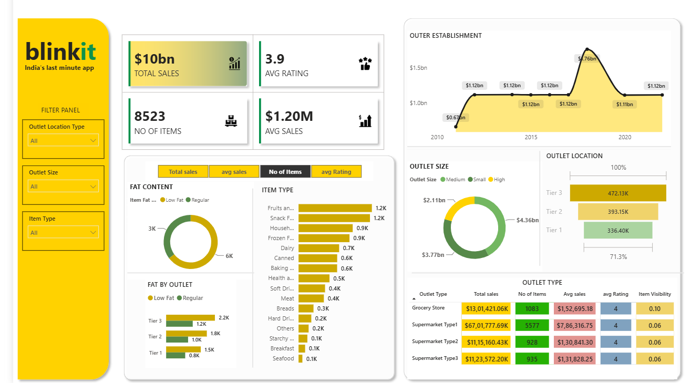

# 📊 Blinkit Sales Analytics Dashboard

An interactive Power BI dashboard designed to analyze Blinkit's sales performance, outlet efficiency, and customer insights through meaningful visualizations and KPIs.

---

## 🚀 Project Overview

This dashboard converts raw sales data into actionable business insights using Power BI.

It enables users to:

- Analyze sales performance
- Compare outlet performance
- Monitor customer ratings
- Explore product category sales
- Track outlet establishment trends
- Interact with dynamic filters and slicers

---

## 📈 Dashboard KPIs

| KPI | Value |
|------|--------|
| Total Sales | $1.20M |
| Average Sales | $141 |
| Number of Items | 8,523 |
| Average Rating | 3.9 |

---

## 📊 Dashboard Features

- Sales by Outlet Type
- Sales by Outlet Size
- Sales by Location
- Item Type Analysis
- Fat Content Analysis
- Outlet Establishment Trends
- Interactive Filters

---

## 🛠 Tools Used

- Power BI
- Power Query
- DAX

---

## 📷 Dashboard Preview

(Add your dashboard screenshot here)

---

## 📁 Files Included

- Power BI (.pbix)
- Dataset
- Dashboard Screenshots
- Demo Video

---

## 💡 Skills Demonstrated

- Data Cleaning
- Data Transformation
- Data Modeling
- DAX
- Dashboard Design
- KPI Development
- Business Intelligence
- Data Visualization
## Dashboard Preview

---

⭐ If you found this project interesting, feel free to star the repository!
